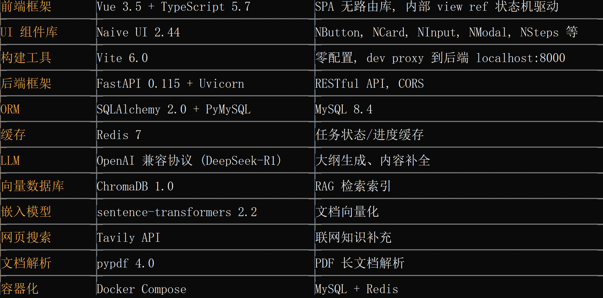
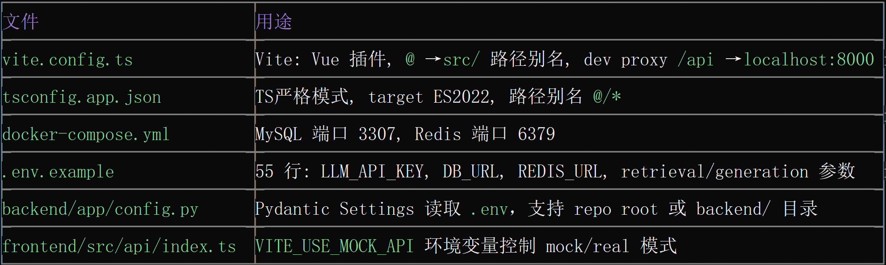

一、目录结构概览
PPT_outline_generation/
├── .env.example                  # 环境变量模板
├── .gitignore
├── README.md
├── docker-compose.yml            # MySQL 8.4 + Redis 7
│
├── backend/                      # 【后端核心模块】
│   ├── requirements.txt
│   ├── app/
│   │   ├── main.py               # ★ FastAPI 入口
│   │   ├── config.py             # Pydantic 配置中心
│   │   ├── database.py           # SQLAlchemy MySQL 连接
│   │   ├── redis_client.py       # Redis 客户端
│   │   ├── task_store.py         # 任务持久化
│   │   ├── api/routes/
│   │   │   ├── tasks.py          # ★ 核心路由 (1462行, 全部业务接口)
│   │   │   └── health.py         # 健康检查
│   │   ├── services/
│   │   │   ├── orchestration.py  # ★ RAG+LLM 编排核心 (614行)
│   │   │   ├── page_generation.py    # 单页生成
│   │   │   ├── skeleton.py           # 骨架生成
│   │   │   ├── generation.py         # LLM 大纲生成
│   │   │   ├── clarification.py      # 澄清问答
│   │   │   └── document_processing.py # 长文档预处理
│   │   └── retrieval/            # 【检索子模块】
│   │       ├── retriever.py      # 多源检索引擎
│   │       ├── embedding/        # sentence-transformers 嵌入
│   │       ├── index/            # ChromaDB 向量索引
│   │       ├── sources/          # 本地 + Tavily 网页搜索
│   │       └── reranker/         # 重排序
│   └── tests/                    # pytest 测试
│
├── frontend/                     # 【前端核心模块】
│   ├── index.html                # ★ HTML 入口
│   ├── package.json
│   ├── vite.config.ts            # ★ Vite 构建配置
│   ├── tsconfig.json / tsconfig.app.json / tsconfig.node.json
│   └── src/
│       ├── main.ts               # ★ Vue 应用入口
│       ├── App.vue               # ★ 根组件 (864行, SPA主控)
│       ├── api/
│       │   ├── index.ts          # API 门面 (mock/real 切换)
│       │   ├── httpApi.ts        # 真实后端 HTTP 调用
│       │   └── mockApi.ts        # Mock API (前端独立开发)
│       ├── components/
│       │   ├── SlideDeckView.vue # 幻灯片展示
│       │   ├── SlidePanel.vue    # 单页幻灯片面板
│       │   ├── GeneratingView.vue # 生成进度视图
│       │   └── TaskSidebar.vue   # 任务历史侧边栏
│       ├── types/task.ts         # TypeScript 类型定义
│       ├── utils/outlineToMarkdown.ts
│       └── mocks/mockTask.ts
│
└── docs/                         # 文档
    ├── api_contract_v1.md        # API 契约 v1.1.0
    ├── evaluation/               # 评估框架
    └── management/               # 项目管理文档

二、技术栈

层级	技术	说明
前端框架	Vue 3.5 + TypeScript 5.7	SPA 无路由库, 内部 view ref 状态机驱动
UI 组件库	Naive UI 2.44	NButton, NCard, NInput, NModal, NSteps 等
构建工具	Vite 6.0	零配置, dev proxy 到后端 localhost:8000
后端框架	FastAPI 0.115 + Uvicorn	RESTful API, CORS
ORM	SQLAlchemy 2.0 + PyMySQL	MySQL 8.4
缓存	Redis 7	任务状态/进度缓存
LLM	OpenAI 兼容协议 (DeepSeek-R1)	大纲生成、内容补全
向量数据库	ChromaDB 1.0	RAG 检索索引
嵌入模型	sentence-transformers 2.2	文档向量化
网页搜索	Tavily API	联网知识补充
文档解析	pypdf 4.0	PDF 长文档解析
容器化	Docker Compose	MySQL + Redis
测试	pytest 8.0	后端单测

三、主要功能与业务逻辑

核心功能：从用户主题/长文档出发，通过 4 步引导式流程 生成 PPT 大纲：
Step 1: 基本信息       
Step 2: 澄清问答       
Step 3: 骨架确认       
Step 4: 大纲结果

输入主题/文档    →   LLM 生成澄清问题    →   生成页级骨架结构   →   逐页生成完整内容
                    
用户回答            用户确认/调整页顺序    支持单页重新生成(RAG)

业务流水线（后端 services/orchestration.py）：
1. 文档预处理 — PDF 解析 → 分块 → 提取核心概要
2. 澄清问答 — LLM 根据主题生成 3-5 个澄清问题，用户回答后引导方向
3. 骨架生成 — LLM 生成 PPT 页面结构（标题 + 每页子标题）
4. 逐页生成（RAG 增强） — 每页触发检索流水线：
- 本地 ChromaDB 检索 + Tavily 网页搜索
- 重排序 → 匹配证据
- LLM 融合检索结果生成单页内容（含标题、要点、证据引用）
5. 编辑与重生成 — 支持调整大纲顺序、修改内容、单页重新生成
   
前端视图状态机：form → status → skeleton → result，通过 view ref 切换渲染，无需 vue-router。

四、代码规范与关键配置

关键配置文件

文件	用途
vite.config.ts	Vite: Vue 插件, @ → src/ 路径别名, dev proxy /api → localhost:8000
tsconfig.app.json	TS严格模式, target ES2022, 路径别名 @/*
docker-compose.yml	MySQL 端口 3307, Redis 端口 6379
.env.example	55 行: LLM_API_KEY, DB_URL, REDIS_URL, retrieval/generation 参数
backend/app/config.py	Pydantic Settings 读取 .env，支持 repo root 或 backend/ 目录
frontend/src/api/index.ts	VITE_USE_MOCK_API 环境变量控制 mock/real 模式

代码规范
- Python: 标准 FastAPI 项目结构, app/ 下 api/, services/, retrieval/ 三层分离
- TypeScript/Vue: SFC 单文件组件, Composition API (ref, computed, watch), 无 class 组件
- 命名规范: Python 使用 snake_case, TypeScript 使用 camelCase, Vue 组件用 PascalCase
- 无 Linter 配置: 当前无 ESLint / Prettier / Ruff 配置文件
- 无 pytest.ini / pyproject.toml: pytest 使用默认配置

API 设计规范
- 全部 RESTful, base path /api/tasks
- 任务状态机：created → clarifying → skeleton_ready → outline_ready → completed
- 统一错误格式：{"detail": "error message"}
- 长轮询进度接口：GET /api/tasks/{id}/progress
- 详见 docs/api_contract_v1.md (v1.1.0, 675 行完整契约)